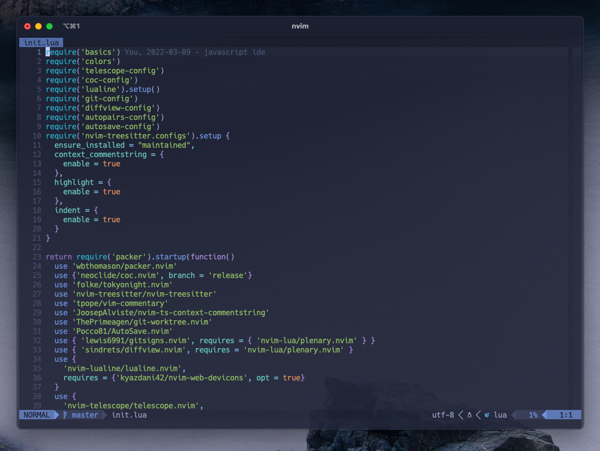

# Neovim для разработки на JavaScript

Сборка NeoVim для разработки. Лично использую для разработки на: **ReactJS** и **NodeJS**.

Данная сборка будет постоянно улучшаться, ведь для vim нет предела, всегда есть что подкрутить.

Для автокомплита на данный момент используется COC.

## Управление NeoVim IDE

Основное

**ESC** - выйти в командные режим

**i** - войти в режим набора текста на текущей позиции курсора

**a -** войти в режим набора текста на следующей позиции курсора ****

**A** - войти в режим набора текста в конце текущей строки

**o** - войти в режим набора текста на строке ниже, создав её

**:q!** - выйти из редактора без сохранения

**:wq!** - сохранить изменения и выйти

Перемещеине по тексту

**h** - влево

**k** - вверх

**l** - вправо

**j** - вниз

**w** - на начало следующего слова

**e** - на конец следующего слова

**b** - на начало предыдущего слова

**0** - в начало строки

**$** - в конец строки

**gg** - начало документаlet g:tagbar_type_json = {
    \ 'ctagstype' : 'json',
    \ 'kinds' : [
      \ 'o:objects',
      \ 'a:arrays',
      \ 'n:numbers',
      \ 's:strings',
      \ 'b:booleans',
      \ 'z:nulls'
    \ ],
  \ 'sro' : '.',
    \ 'scope2kind': {
    \ 'object': 'o',
      \ 'array': 'a',
      \ 'number': 'n',
      \ 'string': 's',
      \ 'boolean': 'b',
      \ 'null': 'z'
    \ },
    \ 'kind2scope': {
    \ 'o': 'object',
      \ 'a': 'array',
      \ 'n': 'number',
      \ 's': 'string',
      \ 'b': 'boolean',
      \ 'z': 'null'
    \ },
    \ 'sort' : 0
    \ }

**G** - конец документа

**5gg** - на строку 5

**/test** - найти вхождение по слову

**n** - перейти к следующему вхождению

**N** - перейти к предыдущему вхождению

**?test** - найти вхождение в документе выше и перейти к нему

**vi’** - выделить текст между кавычками (скобками и так далее)

Удаление, копирование, вставка

**x** - вырезать символ под курсором или выделенный текст

**dd** - вырезать всю строку

**dw** - вырезать до конца слова от текущей позиции

**diw** - вырезать все слово, не зависимо где находится курсор

**d$** - вырезать до конца строки

**p** - вставить раннее вырезанное справа от курсора

**P** - вставить ранее вырезанное слева от курсора

**u** - отмена предыдущего действия

**CTRL + R** - повтор отмененного действия

**.** - повторить последнее действие еще раз

**5dw** - удалить пять слов

**V** - режим выделения целой строки

**y** - копирование

**p** - вставка после курсором

**P** - вставка перед курсором

Комментирование

**gcc** - комментирование/разкоментирование строки (плагин vim commentary)

**gc** - комментирование/разкомментаирование выделенного блока

Telescope

**Ctrl + P** - поиск файла

**Ctrl + F** - поиск по файлам (grep)

**Ctrl + B** - последние открытые файлы (buffers)

**Space + fb** - открыть file browser

**Shift + N** - ввести имя нового файла

**Shift + R** - переименование, ввести новое имя файла

**Shist + D** - удалить выбранный файл/папку

**Ctrl + T** - git worktree

**Ctrl + G** - все ветки git 

 Работа с COC (автодопонение кода, переход к обхявленной функции и т.д.)

**gd** - перейти к объявлению 

**K** - показать документацию

**space + rn** - переименование (рефакторинг) 

**space + f** - запуск prettier

**space + l** - запуск eslint

**Ctrl + R** - обновить файл (refrash)

**space + .** - вызвать окно с возможными действиями

Работа с рабочим пространством

**vs** - вертикальное разделение

**sp** - горизонтальное разделение

**tn** - новый таб

**tk** - следующий таб

**tj** - предудущий таб

**to** - закрытие табов

**Ctrl + n** - открытие справа дерево файлов

**space + t** - открытие терминала
**space + g** - открытие lazygit в терминале

**Ctrl + O** - возвращение к прошлой локации (например, к прошлому файлу редактирования)

Команды

**:MarkdownPreview** - запускает браузер с просмотром markdown документа в реальном времени

**:ZenMode** - режим zen

Терминал

**Ctrl+\\** - открыть/закрыть терминал

## Внешний вид (скриншоты)

NeoVim + Open file. Терминал iTerm2 

### Видео

